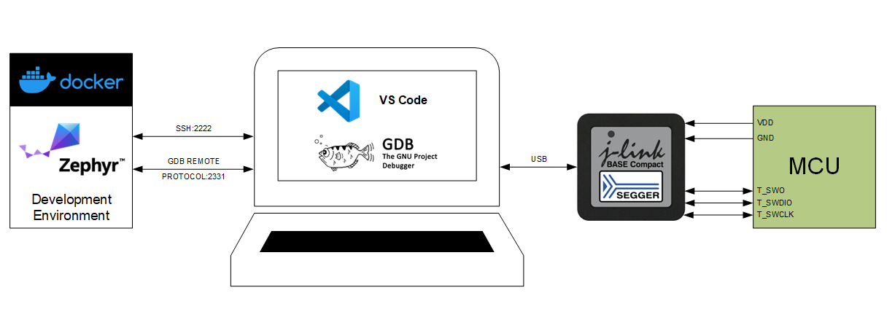
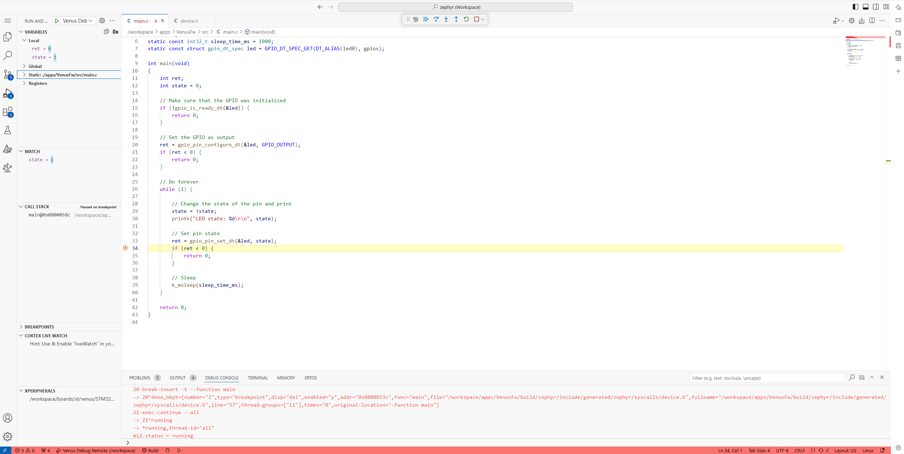

# Venus Zephyr Development Environment

Welcome to the Venus Zephyr Development Environment! This setup helps you create Docker images with the Zephyr toolchain for the Venus Project. You’ll use this environment to build your projects, store files in the `workspace/` folder, and work in either Visual Studio Code (recommended) or other tools.



## Getting Started

You have two ways to use this environment:

1. **Browser Option**: Use a pre-made VS Code instance by opening `http://localhost:8800` in your browser.
2. **VS Code Option (default)**: Connect your local VS Code to the running container. Open `File > Open Workspace from File...` and select `/zephyr.code-workspace`.

## What You Need Before Starting

Make sure you have these installed:

- (Windows) [WSL 2](https://docs.docker.com/engine/install/)
- [Docker Engine](https://www.docker.com/products/docker-desktop/)
- [Python](https://www.python.org/downloads/)
- [JLink](https://www.segger.com/downloads/jlink/)
- [Usbipd](https://learn.microsoft.com/en-us/windows/wsl/connect-usb#install-the-usbipd-win-project)

---

## Build and Run the Docker Image

1. **Build the Image**: Open a terminal, navigate to the project directory, and run:
    ```sh
    docker build -t env-zephyr-venus -f Dockerfile .
    ```
2. **Run the Image**: Use this command to start the container (this also mounts your `workspace/` folder and opens the required ports):
    ```sh
    docker run --rm -it -p 0.0.0.0:2222:22 -p 8800:8800 -v "${PWD}/workspace:/workspace" -w /workspace env-zephyr-venus
    ```
---

## How to Connect

### Option 1: Use Your Browser
Go to [http://localhost:8800/](http://localhost:8800/) to start working with the environment.

**Important Notes:**

- `workspace/` is the shared folder between your machine and the container.
- `/opt/toolchains/zephyr/` contains the Zephyr RTOS source code (read-only).

### Option 2: Use VS Code with SSH
Prefer using your own VS Code setup? Here’s how:

1. Install the [Remote - SSH extension](https://marketplace.visualstudio.com/items?itemName=ms-vscode-remote.remote-ssh).
2. Create a new connection to: `root@localhost:2222`.
3. Connect and login using the password in the Dockerfile (default: `zephyr`).
4. Go to **File > Open Workspace from File..** and select the **/zephyr.code-workspace** file when prompted. Enter the password again if requested. This should configure your VS Code workspace with the */workspace* directory mapped from the host along with */opt/toolchains/zephyr* and */opt/toolchains/modules* so you can browse the Zephyr RTOS source files.

---

## Recommended VS Code Extensions

These extensions are already included in the Docker setup:

- [C/C++](https://marketplace.visualstudio.com/items?itemName=ms-vscode.cpptools)
- [CMake Tools](https://marketplace.visualstudio.com/items?itemName=ms-vscode.cmake-tools)
- [nRF DeviceTree](https://marketplace.visualstudio.com/items?itemName=nordic-semiconductor.nrf-devicetree)
- [Microsoft Hex Editor](https://marketplace.visualstudio.com/items?itemName=ms-vscode.hexeditor)
- [Debug Tracker](https://marketplace.visualstudio.com/items?itemName=mcu-debug.debug-tracker-vscode)
- [MemoryView](https://marketplace.visualstudio.com/items?itemName=mcu-debug.memory-view)
- [RTOS Views](https://marketplace.visualstudio.com/items?itemName=mcu-debug.rtos-views)
- [Peripheral Viewer](https://marketplace.visualstudio.com/items?itemName=mcu-debug.peripheral-viewer)
- [Cortex Debug](https://marketplace.visualstudio.com/items?itemName=marus25.cortex-debug)

---

## Build the Venus Project

Run the following commands in your terminal to build the Venus firmware (Venus is based on the STM32 NUCLEO-U5A5ZJ-Q board):

```sh
cd apps/VenusFw
west build -p always -b stm32u5a9j -- -DBOARD_ROOT='/workspace/'
```

### Explanation of `west build` Parameters:
- **`-p always`**: Forces a reconfiguration of the build directory, ensuring changes are applied.
- **`-b stm32u5a9j`**: Specifies the target board as `stm32u5a9j`.
- **`-DBOARD_ROOT='/workspace/'`**: Sets the `BOARD_ROOT` CMake variable to the `/workspace/` folder, pointing to custom board definitions.
- **`-DDTC_OVERLAY_FILE=venus.overlay`**: You're instructing the build system to include the `venus.overlay` file when generating the final device tree. This ensures that the configurations in the overlay are applied to the hardware description.

Once built, the binary files will be in `workspace/apps/VenusFw/build/zephyr`. You can flash them using [STM32CubeProgrammer](https://www.st.com/en/development-tools/stm32cubeprog.html).

---

## Debugging Setup

If you're debugging with a Segger J-Link device:

1. Run the JLinkGDBServer on your board:
    ```sh
    ./JLinkGDBServerCLExe -if swd -device STM32U5A5ZJ -noLocalhostOnly -rtos GDBServer/RTOSPlugin_Zephyr.dylib
    ```

2. After executing, JLinkGDBServer should state that is is listening for connections:
    ```
    Listening on TCP/IP port 2331
    Connecting to target...
    Halting core...
    Connected to target
    Waiting for GDB connection...
    ```
3. In VS Code, update the .vscode/settings.json file with your GDB server's IP and port (usually your_ip_address:2331).

4. Build your project, go to the "Run and Debug" tab in VS Code, select the debug target (e.g., "Venus Debug Remote"), and hit the play button.



### Explanation of Debug Parameters:
- **`-if swd`**: Uses the Serial Wire Debug (SWD) interface for debugging.
- **`-device STM32U5A5ZJ`**: Specifies the target microcontroller, in this case, `STM32U5A5ZJ`, used on the Venus project board.
- **`-noLocalhostOnly`**: Allows connections to the debugging server from external systems, not just the local machine.
- **`-rtos GDBServer/RTOSPlugin_Zephyr.dylib`**: Loads the Zephyr RTOS plugin, which helps the debugger understand and work with the real-time operating system’s features, like threads and tasks.
